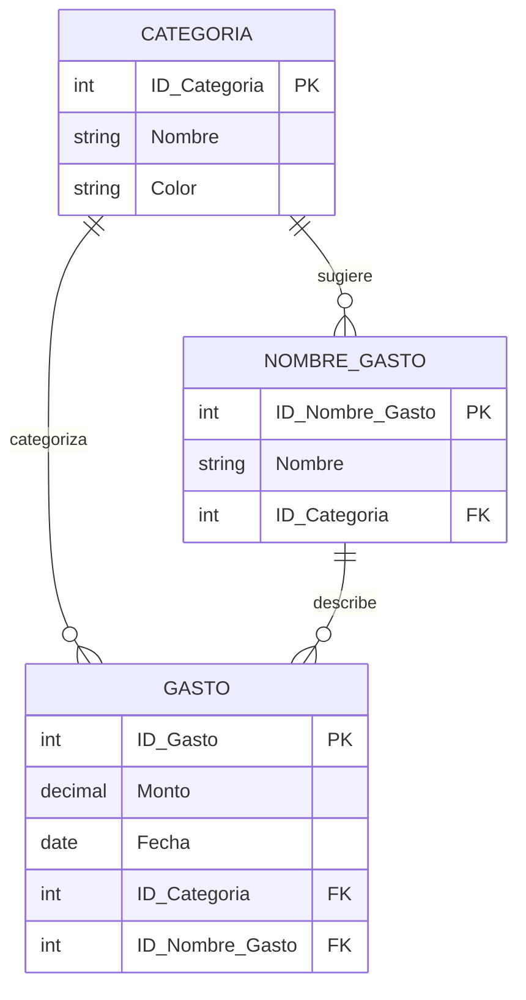

# Proyecto “GastOn”

## Descripción

La idea de este proyecto es solucionar mi problema a la hora de hacer seguimiento y control de mis gastos personales.

**Problema:**
Actualmente no tengo un sistema eficiente para registrar y visualizar mis gastos diarios. Muchas veces olvido anotar compras, no tengo una vista clara de en qué categorías gasto más, y cuando quiero analizar mis patrones de gasto mensual, no tengo la información organizada de forma útil. Las apps existentes son muy complejas o no se adaptan a mi forma simple de categorizar gastos.

**Solución:**
Crear una aplicación móvil que se adapte a mi forma de gestionar gastos, donde cada pantalla esté diseñada para facilitar el registro rápido y la visualización clara de mis gastos. La app debe permitir ver mis gastos semanales de forma organizada, administrar mis categorías personalizadas, y analizar balances por diferentes agrupaciones.

## Alcance del proyecto

**Funcionalidades y Características Esenciales**

1. **Registro de Gastos**
    - Registro rápido de gastos con monto, categoría, nombre y fecha
    - Solo gastos en pesos argentinos
    - Asociación automática a días de la semana
2. **Vista Semanal (Weekly View)**
    - Visualización de gastos por día de la semana actual
    - Organización por categorías dentro de cada día
    - Vista similar a una agenda semanal
3. **Gestión de Categorías y Nombres (Manage)**
    - Creación y edición de categorías de gastos
    - Creación y edición de nombres de gastos predefinidos
    - Eliminación con actualización automática de gastos asociados
4. **Análisis de Balances**
    - Agrupación de gastos por mes, categoría y nombre
    - Dos versiones de visualización: dashboard de totales y listas agrupadas
    - Recálculo automático en tiempo real
5. **Navegación y UX**
    - Bottom navigation con tres secciones principales
    - Modo oscuro
    - Diseño optimizado para uso móvil

## Resumido en vistas

- **Pantalla Weekly View**
    - **Layout**
        - Días de la semana (Lunes a Domingo)
        - Lista de gastos por día mostrando: categoría, nombre del gasto, monto
        - Botón flotante para agregar nuevo gasto
    - **Funcionalidad**
        - Solo muestra semana actual (sin navegación temporal)
        - Scroll vertical por día si hay muchos gastos
        - Touch en gasto para editar
- **Pantalla Manage**
    - **Tab de Categorías**
        - Lista de categorías creadas
        - Opción de crear nueva categoría
        - Edición y eliminación de categorías existentes
    - **Tab de Nombres de Gastos**
        - Lista de nombres predefinidos
        - Creación de nuevos nombres
        - Edición y eliminación con actualización automática
    - **Navegación**
        - Formularios modales para crear/editar
        - Confirmación para eliminaciones
- **Pantalla Balances**
    - **Selector de Vista**
        - Toggle entre "Dashboard" y "Lista Agrupada"
    - **Dashboard de Totales**
        - Total por mes actual
        - Totales por categoría
        - Totales por nombre de gasto
    - **Lista Agrupada**
        - Secciones colapsables por mes
        - Subsecciones por categoría
        - Detalle por nombre de gasto
    - **Funcionalidad**
        - Actualización automática al modificar gastos
        - Mockup inicial con selector para probar ambas versiones

## Entidades y atributos

1. **Gasto**
    - ID_Gasto (PK)
    - Monto (decimal)
    - Fecha (date)
    - ID_Categoria (FK)
    - ID_Nombre_Gasto (FK)
2. **Categoria**
    - ID_Categoria (PK)
    - Nombre (string)
    - Color (string, opcional)
3. **Nombre_Gasto**
    - ID_Nombre_Gasto (PK)
    - Nombre (string)
    - ID_Categoria (FK, opcional para sugerencia)

## Relación entre entidades

- **Categoria - Gasto**:
    - **Tipo de relación**: Uno a Muchos (1:N)
    - **Descripción**: Una categoría puede tener múltiples gastos, pero cada gasto pertenece a una sola categoría.
- **Nombre_Gasto - Gasto**:
    - **Tipo de relación**: Uno a Muchos (1:N)
    - **Descripción**: Un nombre de gasto puede ser usado en múltiples gastos, pero cada gasto tiene un solo nombre.
- **Categoria - Nombre_Gasto**:
    - **Tipo de relación**: Uno a Muchos (1:N, opcional)
    - **Descripción**: Una categoría puede tener múltiples nombres de gastos asociados como sugerencia, pero un nombre puede existir sin categoría específica.

## Gráfico ER

## Casos de uso

### 1. Registro de Nuevo Gasto

**Actor Principal**: Usuario

**Precondiciones**:

- El usuario debe tener categorías y nombres de gastos creados

**Flujo Principal**:

1. El usuario está en la vista Weekly View
2. El usuario presiona el botón "+" para agregar gasto
3. El sistema muestra un formulario de registro
4. El usuario ingresa el monto, selecciona categoría y nombre del gasto
5. El usuario confirma el registro
6. El sistema guarda el gasto y actualiza la vista semanal

**Postcondiciones**:

- El nuevo gasto aparece en el día correspondiente de la semana
- Los balances se actualizan automáticamente

### 2. Creación de Categoría

**Actor Principal**: Usuario

**Precondiciones**:

- El usuario está en la aplicación

**Flujo Principal**:

1. El usuario navega a la pestaña "Manage"
2. El usuario selecciona el tab "Categorías"
3. El usuario presiona "Crear nueva categoría"
4. El sistema muestra un formulario modal
5. El usuario ingresa el nombre de la categoría
6. El usuario guarda la nueva categoría
7. El sistema actualiza la lista de categorías disponibles

**Postcondiciones**:

- La nueva categoría está disponible para asignar a gastos

### 3. Análisis de Balances

**Actor Principal**: Usuario

**Precondiciones**:

- El usuario debe tener gastos registrados

**Flujo Principal**:

1. El usuario navega a la pestaña "Balances"
2. El usuario puede alternar entre vista "Dashboard" y "Lista Agrupada"
3. En Dashboard: ve totales por mes, categoría y nombre
4. En Lista Agrupada: navega por secciones colapsables
5. Los totales se muestran actualizados en tiempo real

**Postcondiciones**:

- El usuario tiene una visión clara de sus patrones de gasto

### 4. Edición de Gasto Existente

**Actor Principal**: Usuario

**Precondiciones**:

- Debe existir al menos un gasto registrado

**Flujo Principal**:

1. El usuario está en Weekly View
2. El usuario toca un gasto específico
3. El sistema muestra el formulario de edición con datos precargados
4. El usuario modifica los campos necesarios
5. El usuario guarda los cambios
6. El sistema actualiza el gasto y recalcula balances

**Postcondiciones**:

- El gasto modificado se refleja en todas las vistas
- Los balances se actualizan automáticamente

### 5. Eliminación de Categoría con Gastos Asociados

**Actor Principal**: Usuario

**Precondiciones**:

- Debe existir una categoría con gastos asociados

**Flujo Principal**:

1. El usuario está en Manage > Categorías
2. El usuario selecciona eliminar una categoría
3. El sistema muestra advertencia sobre gastos asociados
4. El usuario confirma la eliminación
5. El sistema elimina la categoría y actualiza gastos asociados a "Sin categoría"
6. El sistema actualiza todas las vistas y balances

**Postcondiciones**:

- La categoría no existe más
- Los gastos asociados mantienen su información pero sin categoría específica

## Historias de usuario

### Primera Vez Usando la Aplicación

**Contexto**: María quiere tener mejor control de sus gastos personales. Actualmente anota gastos de forma esporádica en notas del teléfono, pero quiere un sistema más organizado que le permita entender mejor en qué gasta su dinero y cómo se distribuyen sus gastos semanalmente.

### Configuración Inicial

**Como** María

**Quiero** configurar mis categorías personalizadas de gastos

**Para** poder organizar mis gastos según mi estilo de vida

**Criterios de Aceptación**:

1. María abre la aplicación por primera vez
2. Navega a la pestaña "Manage"
3. En el tab "Categorías", crea categorías como: "Comida", "Transporte", "Entretenimiento", "Salud"
4. En el tab "Nombres de Gastos", crea nombres específicos como: "Almuerzo", "Uber", "Cine", "Farmacia"
5. La aplicación guarda todas las categorías y nombres para uso futuro

### Registro de Gastos Diarios

**Como** María

**Quiero** registrar mis gastos diarios de forma rápida

**Para** mantener un registro actualizado sin mucho esfuerzo

**Criterios de Aceptación**:

1. María está en la vista "Weekly View"
2. Presiona el botón "+" para agregar un gasto
3. Ingresa: $500, selecciona "Comida" como categoría y "Almuerzo" como nombre
4. El gasto aparece automáticamente en el día actual (ej: Martes)
5. Repite el proceso durante la semana con diferentes gastos
6. Ve todos sus gastos organizados por día en la vista semanal

### Análisis de Patrones de Gasto

**Como** María

**Quiero** analizar mis gastos por diferentes agrupaciones

**Para** entender mejor mis hábitos financieros

**Criterios de Aceptación**:

1. María navega a la pestaña "Balances"
2. En vista "Dashboard" ve:
    - Total gastado en el mes: $15,000
    - Total por categoría: Comida $8,000, Transporte $4,000, etc.
    - Total por nombre: Almuerzo $3,000, Uber $2,500, etc.
3. Cambia a vista "Lista Agrupada" y navega por:
    - Sección "Enero 2025" (colapsable)
    - Subsección "Comida" con todos los gastos de esa categoría
    - Gastos individuales con fechas y montos específicos

### Gestión y Mantenimiento

**Como** María

**Quiero** modificar categorías y corregir gastos erróneos

**Para** mantener mi información organizada y precisa

**Criterios de Aceptación**:

1. María necesita cambiar "Entretenimiento" por "Ocio"
2. Va a Manage > Categorías, edita el nombre
3. Todos los gastos previamente categorizados como "Entretenimiento" ahora muestran "Ocio"
4. María nota un gasto mal registrado en Weekly View
5. Toca el gasto, modifica el monto de $500 a $450
6. Los balances se actualizan automáticamente reflejando el cambio

### Uso Cotidiano Después de un Mes

**Como** María

**Quiero** mantener el hábito de registro con mínimo esfuerzo

**Para** tener datos consistentes para análisis mensual

**Criterios de Aceptación**:

1. María abre la app y siempre ve la semana actual
2. Agrega gastos rápidamente usando las categorías y nombres ya configurados
3. Ocasionalmente revisa Balances para ver cómo va en el mes
4. Al final del mes, usa la vista "Lista Agrupada" para revisar todos los gastos del mes
5. Identifica patrones: "Gasto más en transporte los viernes", "Los fines de semana gasto más en entretenimiento"

### Flujo Completo en Resumen

1. **Configuración**: María crea sus categorías y nombres de gastos personalizados
2. **Registro Diario**: Agrega gastos de forma rápida en la vista semanal
3. **Análisis Regular**: Revisa balances para entender patrones
4. **Mantenimiento**: Ajusta categorías y corrige gastos según necesidad
5. **Hábito Establecido**: Usa la app como herramienta cotidiana de control financiero

Esta historia muestra cómo María, una usuaria típica, adopta la aplicación para resolver su necesidad de mejor control de gastos, desde la configuración inicial hasta el uso habitual, asegurando que todas las funcionalidades core estén cubiertas y sean útiles en escenarios reales.